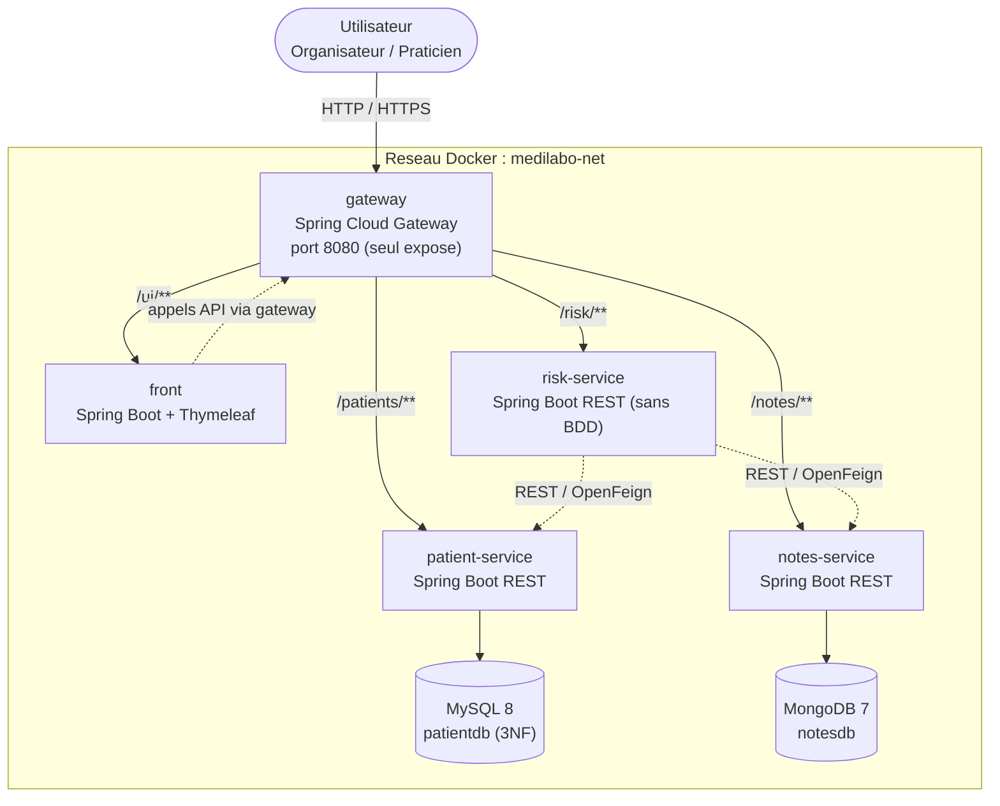
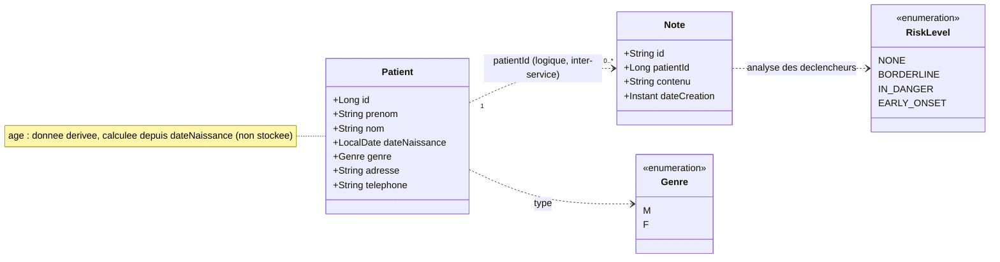
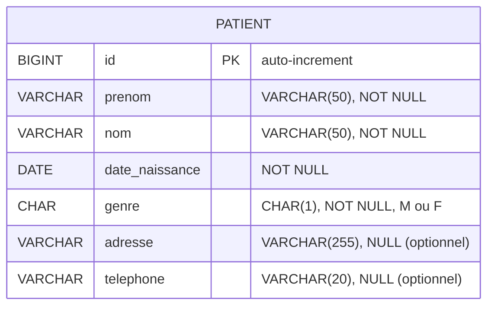
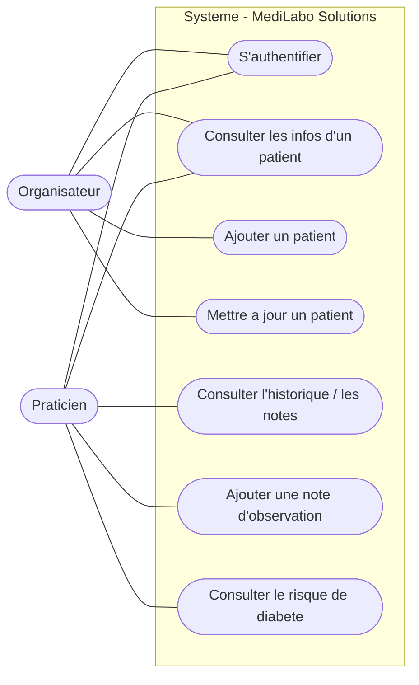
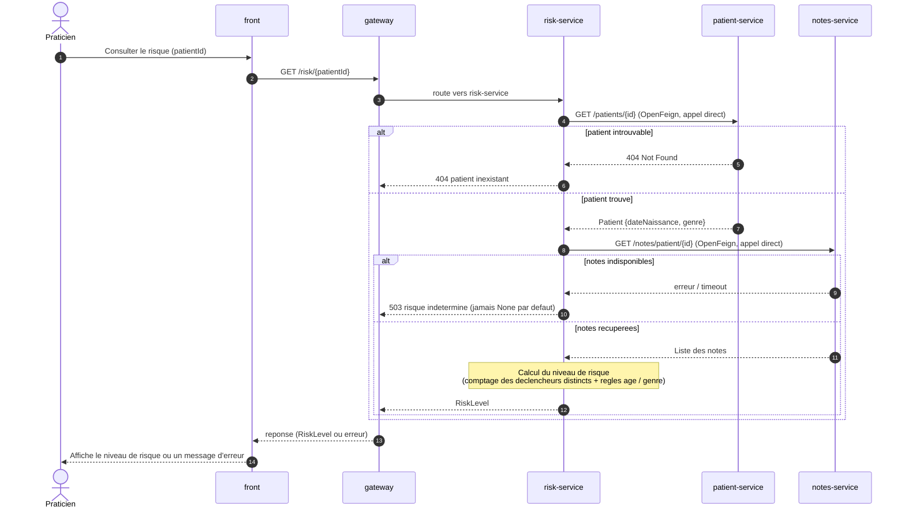
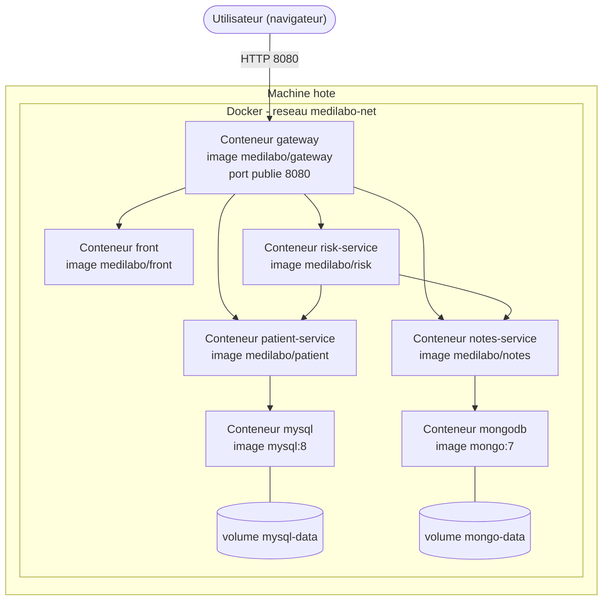

# Stack technique — MédiLabo Solutions

> Solution de dépistage du risque de diabète de type 2, en **architecture microservices**.
> Document de référence : stack, architecture, modèle de données, cas d'utilisation et sécurité.

---

## Sommaire

1. [Contexte & contraintes imposées](#1-contexte--contraintes-imposées)
2. [Stack technique (synthèse)](#2-stack-technique-synthèse)
3. [Architecture microservices](#3-architecture-microservices)
4. [Détail des microservices](#4-détail-des-microservices)
5. [Communication inter-services & routage](#5-communication-inter-services--routage)
6. [Modèle de données & normalisation 3NF](#6-modèle-de-données--normalisation-3nf)
7. [Cas d'utilisation](#7-cas-dutilisation)
8. [Séquence — calcul du risque](#8-séquence--calcul-du-risque)
9. [Sécurité](#9-sécurité)
10. [Conteneurisation & exécution](#10-conteneurisation--exécution)
11. [Tests & qualité](#11-tests--qualité)
12. [Versions retenues & justification](#12-versions-retenues--justification)
13. [Hypothèses & points à valider](#13-hypothèses--points-à-valider)

---

## 1. Contexte & contraintes imposées

Application destinée à des cliniques et cabinets privés pour identifier les patients les plus à risque de diabète de type 2. Livraison en **3 sprints** sur un dépôt **GitHub**.

**Contraintes imposées par le client (non négociables) :**

| # | Contrainte | Impact technique |
|---|------------|------------------|
| C1 | Architecture **microservices**, chaque service = projet **Spring Boot** | Découpage en services indépendants |
| C2 | Accès via un microservice **gateway** (**Spring Cloud Gateway**) | Point d'entrée unique, routage centralisé |
| C3 | **Une image Docker par microservice** | `Dockerfile` par service + orchestration |
| C4 | Bases de données **normalisées 3NF** (certif. ISO) | S'applique à la base SQL `patient` |
| C5 | Accès aux données patients **sécurisé** via **Spring Security** | Authentification sur la gateway et les services |
| C6 | Démarche **Green Code** | Recherche + section dédiée dans le README |
| C7 | Notes : format conservé, **taille non limitée par le modèle métier** (dans les limites techniques de MongoDB : 16 Mo/document), terminologie médicale partagée | Base **NoSQL document (MongoDB)** |
| C8 | Adresse postale & téléphone **optionnels** pour un dossier patient valide | Champs nullables + validation adaptée |

> **Authentification simple.** Le sujet ne demande pas explicitement d'autorisation différenciée entre « organisateur » et « praticien » ni de mécanisme d'inscription. L'application implémente donc une **authentification unique** ; la distinction entre les deux profils est traitée comme **métier** (qui fait quoi dans le parcours de soin) et non comme une **autorisation technique**. Le passage à deux rôles Spring Security reste une évolution possible et documentée (voir grille ASVS L2, chapitre Autorisation).

---

## 2. Stack technique (synthèse)

| Couche | Technologie | Version cible | Rôle |
|--------|-------------|---------------|------|
| Langage | **Java** | **17** (LTS) — 21 possible | Langage de tous les microservices |
| Build | **Maven** | 3.9+ | Build & gestion des dépendances |
| Framework | **Spring Boot** | **3.3.x** | Socle de chaque microservice |
| Microservices | **Spring Cloud** | **2023.0.x (Leyton)** | Gateway, OpenFeign, (Eureka opt.) |
| Gateway | **Spring Cloud Gateway** | via Spring Cloud | Routage / point d'entrée unique |
| API REST | **Spring Web (MVC)** | via Boot | Endpoints REST des services back |
| Persistance SQL | **Spring Data JPA / Hibernate** | via Boot | Service `patient` |
| Base SQL | **MySQL** | **8.x** | `patientdb` (3NF) — PostgreSQL possible |
| Persistance NoSQL | **Spring Data MongoDB** | via Boot | Service `notes` |
| Base NoSQL | **MongoDB** | **7.x** | `notesdb` |
| Client inter-services | **Spring Cloud OpenFeign** | via Spring Cloud | Appels REST déclaratifs (`risk` -> `patient`/`notes`) |
| Sécurité | **Spring Security** | via Boot | Authentification (form login pour le front navigateur, HTTP Basic pour la chaîne API) |
| Front | **Spring Boot + Thymeleaf** | via Boot | UI server-side, sobre |
| Validation | **Bean Validation (Jakarta)** | via Boot | Contrôle des entrées |
| Doc API | **springdoc-openapi (Swagger UI)** | 2.x | Documentation des endpoints |
| Tests | **JUnit 5 + Mockito + Spring Boot Test** | via Boot | Unitaires & intégration |
| Couverture | **JaCoCo** | plugin Maven | Mesure de couverture |
| Conteneurs | **Docker + Docker Compose** | — | Image par service + orchestration |

**Optionnels (bonus, non imposés) :** Spring Cloud Netflix **Eureka** (service discovery), Spring Cloud **Config** (config centralisée), **Testcontainers** (tests d'intégration BDD), **MapStruct** (mapping DTO), **Lombok** (boilerplate), **OWASP Dependency-Check** (scan vulnérabilités).

> **Note sur l'outillage transverse.** `springdoc-openapi` (documentation d'API), `Actuator` (observabilité) et `JaCoCo` (qualité/couverture) figurent dans la table pour l'exhaustivité, mais relèvent de l'**outillage** (documentation, observabilité, qualité) plutôt que des **composants d'architecture** à proprement parler.

---

## 3. Architecture microservices

**Principes structurants :**

- **Un seul point d'exposition** : seule la **gateway** publie un port vers l'extérieur (`8080`). Les services back et les bases ne publient **aucun port** sur l'hôte ; ils communiquent sur le réseau Docker interne par **nom de service**.
- **Indépendance** : chaque microservice est un projet Spring Boot autonome, déployable et dockerisable séparément.
- **Base de données par service** : `patient` possède sa base SQL, `notes` sa base MongoDB. `risk` n'a **aucune** base.
- **Couplage maîtrisé** : `risk` est le seul service qui dépend des autres (lecture seule via REST).

---

## 4. Détail des microservices

### 4.1 `gateway` (Spring Cloud Gateway) — *sprints 1->3*
- **Rôle :** point d'entrée unique, routage vers `front`, `patient`, `notes`, `risk`.
- **Responsabilités sécurité :** filtre d'authentification, CORS, en-têtes de sécurité.
- **Base de données :** aucune.
- **Routes (exemple) :** `/ui/**` -> front, `/patients/**` -> patient, `/notes/**` -> notes, `/risk/**` -> risk.

### 4.2 `patient-service` (Spring Boot + JPA + MySQL) — *sprint 1*
- **Rôle :** CRUD du dossier démographique patient.
- **Base :** MySQL `patientdb` (**3NF**).
- **Endpoints REST (proposition) :**

| Méthode | Endpoint | Description |
|---------|----------|-------------|
| GET | `/patients` | Liste des patients |
| GET | `/patients/{id}` | Détail d'un patient |
| POST | `/patients` | Ajouter un patient |
| PUT | `/patients/{id}` | Mettre à jour un patient |
| DELETE | `/patients/{id}` | (optionnel, non utilisé dans les user stories) Supprimer |

- **Validation (Bean Validation) :** exemples d'annotations sur le DTO patient : `@NotBlank` (prénom, nom), `@NotNull` + `@Past` (date de naissance), `@NotNull` (genre), `@Size` (longueurs max), `@Pattern` (format du téléphone). Adresse et téléphone **nullables** mais validés s'ils sont présents.

### 4.3 `notes-service` (Spring Boot + Spring Data MongoDB) — *sprint 2*
- **Rôle :** gestion des comptes rendus / notes de visite.
- **Base :** MongoDB `notesdb` (texte libre, multi-lignes, format conservé ; taille non bornée par le métier, dans la limite technique de 16 Mo par document BSON).
- **Endpoints REST (proposition) :**

| Méthode | Endpoint | Description |
|---------|----------|-------------|
| GET | `/notes/patient/{patientId}` | Notes d'un patient |
| GET | `/notes/{id}` | Détail d'une note |
| POST | `/notes` | Ajouter une note |

### 4.4 `risk-service` (Spring Boot, sans base) — *sprint 3*
- **Rôle :** calcule le niveau de risque (None / Borderline / In Danger / Early onset).
- **Base :** aucune. Interroge `patient` (âge, genre) et `notes` (déclencheurs) via **OpenFeign**.
- **Endpoint REST (proposition) :**

| Méthode | Endpoint | Description |
|---------|----------|-------------|
| GET | `/risk/{patientId}` | Renvoie le niveau de risque |

### 4.5 `front` (Spring Boot + Thymeleaf) — *sprints 1->3*
- **Rôle :** interface sobre, server-side, commune aux 3 sprints (vue/ajout/màj patient, affichage des notes, ajout de note, affichage du risque).
- **Communication :** appelle les services **via la gateway**.

---

## 5. Communication inter-services & routage

- **Externe -> interne :** tout le trafic **externe** passe par la **gateway** (un seul port exposé).
- **Interne (`risk` -> `patient`/`notes`) :** **appel direct de service à service** via **Spring Cloud OpenFeign** sur le réseau Docker (résolution par nom de service), **sans repasser par la gateway**. C'est l'architecture **retenue** : elle évite un saut réseau superflu et correspond à la pratique microservices courante. La gateway reste réservée au trafic externe.
- **Résilience minimale :** timeouts de connexion/lecture, gestion explicite des cas « service indisponible » (réponse dégradée plutôt que 500 opaque). *Resilience4j possible en bonus.*
- **Découverte de service :** non imposée ; nommage Docker Compose suffisant. **Eureka** reste un bonus valorisable.

---

## 6. Modèle de données & normalisation 3NF

### 6.1 Modèle de domaine (logique)

> `Patient` (SQL) et `Note` (MongoDB) vivent dans **deux services et deux bases distincts**. Le lien entre eux est **logique** (via `patientId`), pas une clé étrangère physique.

### 6.2 Schéma SQL `patient` (justification de la conformité à la 3NF)

**Justification 3NF :**
- **1NF** : tous les attributs sont **atomiques** (pas de champ multi-valué ni répétitif), une clé primaire `id`.
- **2NF** : la clé est simple (`id`), donc aucune dépendance partielle possible — tous les attributs dépendent de la clé entière.
- **3NF** : aucun attribut non-clé ne dépend d'un autre attribut non-clé (**pas de dépendance transitive**) ; prénom, nom, date de naissance, genre, adresse, téléphone dépendent uniquement de `id`.

> Le modèle est volontairement **simple** (conforme au brief). Aucune table de référence supplémentaire n'est requise pour atteindre la 3NF ici.

---

## 7. Cas d'utilisation

> **Convention UML.** Mermaid n'a pas de type natif « diagramme de cas d'utilisation » : il est émulé ici avec un `flowchart` (pour un rendu UML strict — acteurs en bonhomme, cas en ellipses — utiliser PlantUML ou draw.io). Seuls les **cas observables par un acteur** figurent dans le diagramme. La récupération des données patient/notes et le calcul du risque sont des **traitements internes** : ils relèvent du diagramme de séquence (section 8), pas du diagramme de cas d'utilisation.

**Matrice acteurs × cas d'utilisation (vue métier) :**

| Cas d'utilisation | Sprint | Organisateur | Praticien |
|-------------------|:------:|:------------:|:---------:|
| S'authentifier | — | X | X |
| Consulter infos patient | 1 | X | X |
| Ajouter un patient | 1 | X | |
| Mettre à jour un patient | 1 | X | |
| Consulter l'historique / notes | 2 | | X |
| Ajouter une note | 2 | | X |
| Consulter le risque | 3 | | X |

> **Précondition transverse :** « S'authentifier » conditionne tous les autres cas. La répartition organisateur/praticien décrite ici est **fonctionnelle** (elle documente le parcours métier). Le sujet n'imposant pas d'autorisation différenciée, l'implémentation retenue applique une authentification unique : tout compte authentifié accède aux fonctionnalités. La mise en place de deux rôles Spring Security est signalée comme évolution possible.

### Règles de calcul du risque (cas critique du sprint 3)

Comptage = **nombre de termes déclencheurs DISTINCTS** présents dans l'ensemble des notes (recherche **insensible à la casse et aux accents**, variantes gérées : *Fumeur/Fumeuse*, *Vertige/Vertiges*).

| Niveau | Condition |
|--------|-----------|
| **None** | 0 ou 1 déclencheur |
| **Borderline** | 2 à 5 déclencheurs **ET** âge > 30 |
| **In Danger** | H < 30 : 3 · F < 30 : 4 · âge > 30 : 6 ou 7 |
| **Early onset** | H < 30 : >= 5 · F < 30 : >= 7 · âge > 30 : >= 8 |

> **Point d'attention — frontière des 30 ans (sujet ambigu).** Le sujet OpenClassrooms distingue « moins de 30 ans » et « plus de 30 ans » sans préciser le cas **exact de 30 ans**. Interprétation retenue : **`âge > 30` strict** (un patient de 30 ans pile relève de la catégorie « moins de 30 »). À valider avec le correcteur ; conséquence logique : un patient de moins de 30 ans **ne peut jamais** être *Borderline* (cette catégorie exige > 30 ans).

**Termes déclencheurs :** Hémoglobine A1C, Microalbumine, Taille, Poids, Fumeur/Fumeuse, Anormal, Cholestérol, Vertiges, Rechute, Réaction, Anticorps.

**Validation sur les 4 cas de test :** None (1 décl.), Borderline (2 décl., >30 ans), In Danger (3 décl., H <30), Early onset (8 décl., F <30) -> cohérent avec les réponses attendues, ce qui **confirme** le comptage en termes distincts.

---

## 8. Séquence — calcul du risque

> **Architecture retenue :** `risk` appelle `patient` et `notes` **directement** sur le réseau Docker (comme ci-dessus), sans repasser par la gateway. La gateway n'intervient que pour l'entrée externe (`GET /risk/{patientId}`). Une variante « tout via gateway » est possible si le correcteur exige une centralisation stricte, au prix d'un saut réseau supplémentaire.

---

## 9. Sécurité

### 9.1 Authentification & autorisation

**Modèle d'authentification retenu (explicite).** Parmi les architectures possibles (gateway seule, gateway + JWT, gateway + Basic, OAuth2, propagation d'identité, ou chaque service autonome), le projet retient un modèle simple et robuste adapté à son échelle :

- **Front navigateur** : authentification par **form login** (session côté serveur, UI Thymeleaf).
- **Chaîne API (gateway → services back)** : **HTTP Basic**. La gateway authentifie l'entrée puis **transmet l'en-tête `Authorization`** aux services.
- **Chaque microservice back se sécurise lui-même** (Spring Security actif partout) et **ne fait pas une confiance aveugle à la gateway** : un service reste protégé même s'il était joint directement. C'est de la **défense en profondeur**.
- Les services back ne sont de toute façon **joignables que via la gateway** sur le réseau Docker interne (aucun port publié sur l'hôte).

> Ce choix est modifiable (JWT possible si l'on veut du stateless), mais il est **tranché** ici pour lever l'ambiguïté « les services font-ils confiance à la gateway ? » : non, chaque service vérifie l'authentification.

**Règles communes :**
- **Aucun endpoint** patient/notes/risk accessible en anonyme. `permitAll` réservé au login et à `/actuator/health`.
- Mots de passe **hashés** (BCrypt), jamais en clair — même pour les comptes de démo.
- **Aucun credential en dur** dans le code ou Git -> variables d'environnement / config externalisée / secrets Docker.

### 9.2 Exposition réseau
- **Seule la gateway expose un port** vers l'hôte. Les services back et bases ne publient aucun port (`expose` interne uniquement).
- Réseau Docker **dédié** ; communication par nom de service interne.
- Bases de données inaccessibles hors du réseau Docker.

### 9.3 Données & validation
- **Validation systématique des entrées** (Bean Validation) côté serveur : `@NotBlank`, `@NotNull`, `@Past`, `@Size`, `@Pattern` selon les champs.
- **DTO en entrée/sortie**, jamais l'entité JPA/Mongo exposée directement (évite la sur-exposition et le *mass assignment*).
- Anti-injection : requêtes paramétrées (JPA) ; en Mongo, pas de requête construite à partir d'entrées brutes.
- **Anti-XSS** : les notes sont du texte libre ; Thymeleaf échappe par défaut — **ne jamais** utiliser `th:utext` sur le contenu des notes.
- Gestion des erreurs sans fuite d'info (`@ControllerAdvice`, pas de stacktrace renvoyée au client).

### 9.4 Transport & configuration
- HTTPS en cible (au moins documenté) ; CORS restrictif sur la gateway (jamais `*` en prod).
- **Actuator** : `/actuator/health` peut rester public (sonde de vie/Docker healthcheck) ; **tous les autres endpoints Actuator sont authentifiés** ou désactivés.
- Profils Spring séparés (`local`, `docker`) ; secrets hors du dépôt.

### 9.5 Dépendances & build
- Images Docker depuis des **bases officielles à jour** (JRE slim), conteneur en utilisateur **non-root**.
- Versions épinglées (pas de tag `latest` flottant).
- Scan de vulnérabilités des dépendances (OWASP Dependency-Check) — bonus apprécié.

### 9.6 Traçabilité (contexte santé / ISO)
- Journalisation des accès aux données patients (qui consulte quoi).
- **Aucune donnée patient en clair dans les logs** (RGPD / données de santé).

---

## 10. Conteneurisation & exécution

- **Un `Dockerfile` par microservice** (build multi-stage recommandé : compilation Maven puis image JRE slim).
- **`docker-compose.yml`** à la racine orchestrant : `gateway`, `front`, `patient-service`, `notes-service`, `risk-service`, `mysql`, `mongodb`, sur un réseau `medilabo-net`.
- Seul le port de la **gateway** est mappé sur l'hôte.
- Variables d'environnement pour les credentials et URLs de bases (pas de valeurs en dur).
- Volumes Docker pour la persistance des bases.

### Vue de déploiement

---

## 11. Tests & qualité

| Type | Outils | Cible prioritaire |
|------|--------|-------------------|
| Unitaire | JUnit 5 + Mockito | **Moteur de calcul du risque** (règles âge/genre/déclencheurs) |
| Intégration | Spring Boot Test (`@SpringBootTest`, `@DataJpaTest`, `@DataMongoTest`) | Repositories & endpoints REST |
| Intégration BDD (bonus) | Testcontainers | MySQL & MongoDB réels en conteneur |
| Couverture | JaCoCo | Rapport de couverture |
| Doc API | springdoc-openapi (Swagger UI) | Documentation interactive des endpoints |

---

## 12. Versions retenues & justification

| Choix | Valeur | Pourquoi |
|-------|--------|----------|
| Java | **17 (LTS)** | Minimum requis par Spring Boot 3.x ; LTS stable. Java 21 possible. |
| Spring Boot | **3.3.x** | Compatible avec Spring Cloud 2023.0.x. |
| Spring Cloud | **2023.0.x (Leyton)** | Couple validé : supporte Boot 3.2.x/3.3.x. Évite l'erreur « incompatible release train ». |
| Base SQL | **MySQL 8** | Répandu, intégration Spring Data JPA simple. PostgreSQL équivalent si préféré. |
| Base NoSQL | **MongoDB 7** | Document store adapté au texte libre volumineux des notes (jusqu'à 16 Mo/document). |
| Build | **Maven** | Standard du contexte ; BOM Spring Cloud simple à gérer. |

> **Astuce build :** générer chaque projet via **start.spring.io** en sélectionnant la version de Boot souhaitée ; l'Initializr aligne automatiquement la BOM Spring Cloud. Toujours importer la BOM `spring-cloud-dependencies` plutôt que figer les versions des modules à la main.

---

## 13. Hypothèses & points à valider

1. **Patient en SQL, Notes en MongoDB** : le projet est **hybride** (la contrainte 3NF est relationnelle ; le sprint 1 parle de « base SQL »).
2. **Borderline impossible avant 30 ans** : la règle Borderline exige « > 30 ans » ; conséquence logique assumée.
3. **Frontière à 30 ans** : interprétation retenue `âge > 30` (strict) ; à confirmer.
4. **Appels de `risk`** : **appel direct** de service à service retenu (réseau Docker) ; variante « via gateway » possible si le correcteur l'exige.
5. **Green Code** : section dédiée à rédiger dans le `README.md` (recherche à mener, normes non figées).

---

*Document de référence — adaptez les versions et choix optionnels selon les exigences finales du correcteur.*
